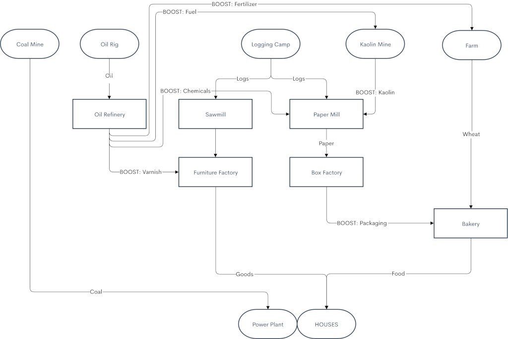

# Lumberjack Industries

>There was a time in this fair land when the railroad did not run\
>When the wild majestic mountains stood alone against the sun\
>Long before the white man and long before the wheel\
>When the green dark forest was too silent to be real\
>— Gordon Lightfoot, [Canadian Railway Trilogy](https://www.youtube.com/watch?v=PXzauTuRG78)

Lumberjack Industries is an industry/economy replacement mod which focuses on creating a balanced supply chain in a harsh northern climate. It's inspired by Alberta, Canada, where the wheat belt meets the Rocky Mountains.

Your company is involved in both transportation and logging. While most natural resources (Coal, Wheat, Kaolin clay) are already available, you'll need to construct Logging Camps to harvest nearby trees.

Factories of all types need Workers to process cargo, and you'll need to connect and grow towns to provide the necessary workforce. With the [Renewed Village Growth](https://www.tt-forums.net/viewtopic.php?f=65&t=87052) Game Script (not included but strongly recommended), they'll demand finished goods, creating a feedback loop to focus your growth and incentivize interesting gameplay. 

(Jump to [Design Philosophy](#design-philosophy))

## Production flowchart

## General industry mechanics
Nearly all industries are generated during map generation, and do not close or spawn during gameplay.

#### Primary industries
* Coal Mine
* Oil Rig
* Kaolin Mine
* Farm

These industries generate away from towns, sometimes with elevation requirements. They have a fixed production and do not require Workers, but have boost cargos which can be delivered to double production. Boost cargos are stockpiled up to 4,096 units and consumed during each production tick (8-9 times per month) to determine how much cargo is produced.

#### Secondary industries
* Oil Refinery
* Sawmill
* Furniture Factory
* Paper Mill
* Box Factory
* Bakery

These industries generate in towns and require a certain population per industry (customizable in NewGRF parameters, default 500). They require one Worker for each unit of input cargo. If this seems like a lot, it is! Workers are the main production bottleneck and you'll need to both connect many towns to each industry, and deliver the necessary cargos to grow these towns.

Also, some of these industries have additional cargos, like Varnish for the Furniture Factory or Packaging for the Bakery. These are not required for production and don't produce any cargo by themselves, but combined with the main input cargo (Lumber and Wheat, respectively) make the factory more efficient. A Furniture Factory can use 1 unit of Lumber to produce 0.5 units of Goods, or 1 unit of Lumber and 0.5 units of Varnish to produce 1 unit of Goods. These quasi-boost cargos are stockpiled up to 4,096 units.

## Special industry mechanics
##### Logging Camp
* Must be funded by the player.
* Only cuts trees December-March.
  * The ground is frozen, allowing easier transportation.
  * Allows trees to regrow for sustainable forestry.

##### Farm
* Only harvests Wheat September through November, but in massive amounts which can overwhelm your network.
* Wheat loses station ratings extra-quickly if too much is waiting to be loaded. It must be transported promptly before it rots!

##### Power Plant
* Produces nothing, but accepts Coal, which is a required cargo for growing large cities.
* You may have to fund these in cities which demand Coal, but by that stage they are quite cheap.

## Getting started

Primary cargos are only marginally profitable, so you'll want to start producing high-value consumer goods as quickly as possible to fund further growth. I suggest starting with Wheat to produce Food. Don't forget that you'll need to bring Workers to the Bakery.

You will quickly enter a cycle of needing Workers to fuel industrial production, and needing town goods (Mail, Food, Goods, Coal) to grow towns to provide more Workers. When you can afford it, start adding production lines for other cargos, like `Logging Camp > Sawmill > Furniture Factory` to produce Goods and keep towns growing.

Industry probabilities and maximum production quantities are balanced such that on an average map, it will be possible to achieve 100% productivity at all generated primary industries with just the right amount of boost cargo available. (Whether or not enough Workers will exist to process this cargo depends on your town density setting.)

#### Required NewGRFs
* Improved Town Layouts 1.5.0 or better
* [Renewed Village Growth](https://www.tt-forums.net/viewtopic.php?f=65&t=87052) Game Script
* OpenGFX+ Landscape
  * Not strictly required, but strongly recommended.
  * Enables a variable snow line which changes by the season. Set the January and July snow line in NewGRF parameters according to your map height.

#### Recommended game settings
* Cargo Distribution
  * Passengers: Manual
  * Mail: Asymmetric
  * Others: Manual

#### (Optional) Suggested NewGRFs
My personal favorites, if you don't have your own.
* Flume: Log Flumes!
* Iron Horse 2
* CHIPS Station Set
* Industrial Stations Renewal
* Mop Expanded Road Vehicles
* Unspooled (roads)
* HEQS (Heavy Equipment Set)
* SHARK (ships)

## Design philosophy
Lumberjack Industries builds on my previous industry set, [Industries of the Caribbean](https://github.com/2TallTyler/industries_of_the_caribbean), to focus on the logistics aspects of OpenTTD more than the tycoon aspects. Making money is easy and not interesting past the early game, but delivering the right amounts of cargo to the right places can be quite challenging.

I also aimed to reclaim "useless" parts of OpenTTD's core game design and incentivize interesting and varied gameplay:

**Problem**: Towns are useless and get in the way of infrastructure for transporting industrial cargos.\
**Solution**: Towns are the only source of workers, crucial for industrial production.

**Problem**: Black hole cargos (Food, Goods, Coal) don't contribute to industrial production.\
**Solution**: They are required for town growth, and we need to grow towns to provide Workers.

**Problem**: Mail doesn't do anything besides make money (which we've already established is easy).\
**Solution**: Mail is the main cargo for town growth.

**Problem**: Industry production is too great for road vehicles to effectively handle. Trains are almost always better.\
**Solution**: Relatively-low fixed primary industry production is suitable for road vehicles, inconvenient industry placement atop hills makes trains unsuitable for some industries, and small amounts of boost cargos makes a short-distance highway network suitable and easier to build than rail links.

**Problem**: Helicopters are expensive and don't carry much. What do we use them for?\
**Solution**: They are perfect for carrying Food to Oil Rigs to boost production.